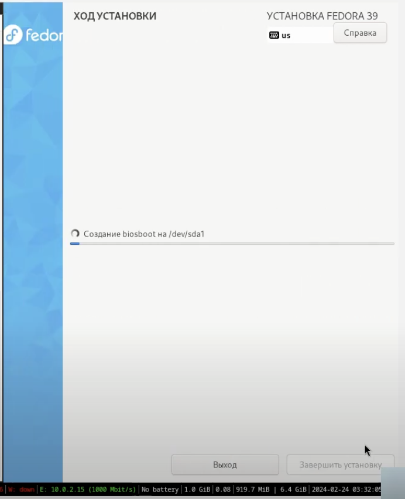
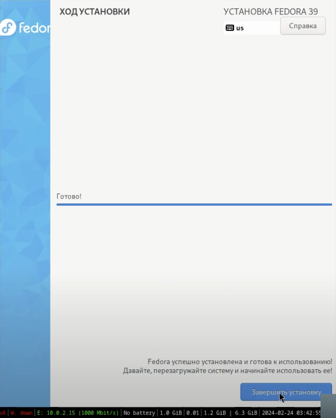

---
## Front matter
lang: ru-RU
title: Лабораторная работа №1
subtitle: Операционные системы
author:
  - Лисенков Егор, НКАбд-03-23
institute:
  - Российский университет дружбы народов, Москва, Россия
date: 28 февраля 2024

## i18n babel
babel-lang: russian
babel-otherlangs: english

## Formatting pdf
toc: false
toc-title: Содержание
slide_level: 2
aspectratio: 169
section-titles: true
theme: metropolis
header-includes:
 - \metroset{progressbar=frametitle,sectionpage=progressbar,numbering=fraction}
 - '\makeatletter'
 - '\beamer@ignorenonframefalse'
 - '\makeatother'
---

## Цель работы

Целью данной работы является приобретение практических навыков установки операционной системы на виртуальную машину, настройки минимально необходимых для дальнейшей работы сервисов.

## Задание

1. Создание виртуальной машины
2. Установка операционной системы
3. Работа с операционной системой после установки
4. Установка программного обеспечения для создания документации
5. Дополнительные задания

## Выполние лабораторной работы

### Создание виртуальной машины

Скачаю с оффициального сайта fedora.get образ ISO для установки

{#fig:01 width=70%}

Далее запускаю VirtualBox и нажимаю на кнопку создать, после чего выбираю файл ISO.

{#fig:01 width=70%}

Внесём небольшие настройки, а именно в память и использование процессора.

{#fig:01 width=70%}

Настраиваем резерв памяти для жесткого диска.

{#fig:01 width=70%}

Создаём виртуальную машину и выбираем двунаправленность в разделе общие.

{#fig:01 width=70%}

### Установка операционной системы 

Далее запускаем операционную систему.

{#fig:01 width=70%}

Заходим в терминал и вбиваем команду liveinst для запуска установщика Fedora.

{#fig:01 width=70%}

Начинаем установку и поподаем на первый экран установки.

{#fig:01 width=70%}

Выполняем все действия, чтобы установщик не выдавал ошибку.

{#fig:01 width=70%}

Запуск установщика и ожидание.

{#fig:01 width=70%}

Успешная установка!

{#fig:01 width=70%}

Выключаем виртуальную машину и в параметре "Носители" выбираем пункт "Изьять диск из привода"

{#fig:01 width=70%}

### Работа после установки

Обновим все пакеты с помощью команды dnf -y update .

{#fig:01 width=70%}

Установим программы для удобства работы в консоли: dnf -y install tmux mc .

{#fig:01 width=70%}

Установка программного обеспечения: dnf install dnf-automatic .

{#fig:01 width=70%}

Запуск таймера: systemctl enable --now dnf-automatic.timer

{#fig:01 width=70%}

В файле /etc/selinux/config заменим значение

SELINUX=enforcing

на значение

SELINUX=permissive

Перегрузим виртуальную машину:

reboot

{#fig:01 width=70%}

{#fig:01 width=70%}

{#fig:01 width=70%}

Перезапустим систему 

{#fig:01 width=70%}

Запустим терминальный мультиплексор tmux:

tmux

Переключимся на роль супер-пользователя:

sudo -i

Установим средства разработки:

dnf -y group install "Development Tools"

{#fig:01 width=70%}

Установим пакет DKMS:

dnf -y install dkms

{#fig:01 width=70%}

В меню виртуальной машины подключим образ диска дополнений гостевой ОС.

Подмонтируем диск:

mount /dev/sr0 /media

Установим драйвера:

/media/VBoxLinuxAdditions.run

Перегрузим виртуальную машину:

reboot

{#fig:01 width=70%}
{#fig:01 width=70%}

### Настройка раскладки клавиатуры

Войдите в ОС под заданной вами при установке учётной записью.

Нажмите комбинацию Win+Enter для запуска терминала.

Запустите терминальный мультиплексор tmux:

tmux
Создайте конфигурационный файл ~/.config/sway/config.d/95-system-keyboard-config.conf:

touch ~/.config/sway/config.d/95-system-keyboard-config.conf

Отредактируйте конфигурационный файл ~/.config/sway/config.d/95-system-keyboard-config.conf:

exec_always /usr/libexec/sway-systemd/locale1-xkb-config --oneshot

Переключитесь на роль супер-пользователя:

sudo -i

Отредактируйте конфигурационный файл /etc/X11/xorg.conf.d/00-keyboard.conf:

Section "InputClass"
        Identifier "system-keyboard"
        MatchIsKeyboard "on"
        Option "XkbLayout" "us,ru"
        Option "XkbVariant" ",winkeys"
        Option "XkbOptions" "grp:rctrl_toggle,compose:ralt,terminate:ctrl_alt_bksp"
EndSection

Для этого можно использовать файловый менеджер mc и его встроенный редактор.
Перегрузите виртуальную машину:

reboot

{#fig:01 width=70%}
{#fig:01 width=70%}

### Установка программного обеспечения для создания документации

Установим средство pandoc для работы с языком разметки Markdown.

Установка с помощью менеджера пакетов:

dnf -y install pandoc

{#fig:01 width=70%}

Установим дистрибутив TeXlive:

dnf -y install texlive-scheme-full

{#fig:01 width=70%}

Проверим корректность выполнения прошлых команд и общую работу системы.

{#fig:01 width=70%}

{#fig:01 width=70%}

## Выполнение домашнего задания

Получим следующую информацию.

Версия ядра Linux (Linux version).

Частота процессора (Detected Mhz processor).

Модель процессора (CPU0).

Объём доступной оперативной памяти (Memory available).

Тип обнаруженного гипервизора (Hypervisor detected).

Тип файловой системы корневого раздела.

Последовательность монтирования файловых систем.

{#fig:01 width=70%}

{#fig:01 width=70%}

## Список литературы{.unnumbered}

::: {#refs}

1. Dash P. Getting started with oracle vm virtualbox. Packt Publishing Ltd, 2013. 86 p.

2. Colvin H. Virtualbox: An ultimate guide book on virtualization with virtualbox. CreateSpace Independent Publishing Platform, 2015. 70 p.

3. van Vugt S. Red hat rhcsa/rhce 7 cert guide : Red hat enterprise linux 7 (ex200 and ex300). Pearson IT Certification, 2016. 1008 p.

4. Робачевский А., Немнюгин С., Стесик О. Операционная система unix. 2-е изд. Санкт-Петербург: БХВ-Петербург, 2010. 656 p.

5. Немет Э. et al. Unix и Linux: руководство системного администратора. 4-е изд. Вильямс, 2014. 1312 p.

6. Колисниченко Д.Н. Самоучитель системного администратора Linux. СПб.: БХВ-Петербург, 2011. 544 p.

7. Robbins A. Bash pocket reference. O’Reilly Media, 2016. 156 p.

:::
