---
## Front matter
title: Лабораторная работа №2
subtitle: Операционные системы
author: Лисенков Егор, НКАбд-03-23

## Generic otions
lang: ru-RU
toc-title: "Содержание"
institute:
  - Российский университет дружбы народов, Москва, Россия
date: 28 февраля 2024

## Pdf output format
toc: true # Table of contents
toc-depth: 2
lof: true # List of figures
lot: true # List of tables
fontsize: 12pt
linestretch: 1.5
papersize: a4
documentclass: scrreprt
## I18n polyglossia
polyglossia-lang:
  name: russian
  options:
	- spelling=modern
	- babelshorthands=true
polyglossia-otherlangs:
  name: english
## I18n babel
babel-lang: russian
babel-otherlangs: english
## Fonts
mainfont: PT Serif
romanfont: PT Serif
sansfont: PT Sans
monofont: PT Mono
mainfontoptions: Ligatures=TeX
romanfontoptions: Ligatures=TeX
sansfontoptions: Ligatures=TeX,Scale=MatchLowercase
monofontoptions: Scale=MatchLowercase,Scale=0.9
## Biblatex
biblatex: true
biblio-style: "gost-numeric"
biblatexoptions:
  - parentracker=true
  - backend=biber
  - hyperref=auto
  - language=auto
  - autolang=other*
  - citestyle=gost-numeric
## Pandoc-crossref LaTeX customization
figureTitle: "Рис."
tableTitle: "Таблица"
listingTitle: "Листинг"
lofTitle: "Список иллюстраций"
lotTitle: "Список таблиц"
lolTitle: "Листинги"
## Misc options
indent: true
header-includes:
  - \usepackage{indentfirst}
  - \usepackage{float} # keep figures where there are in the text
  - \floatplacement{figure}{H} # keep figures where there are in the text
---

# Цель работы

Научиться оформлять отчёты с помощью легковесного языка разметки Markdown.

# Задание

1. Понять базовые принципы работы с языком разметки Markdown.

# Выполние лабораторной работы

## Установка git

#### Установим git:

dnf install git

#### Установка gh

Fedora:

dnf install gh

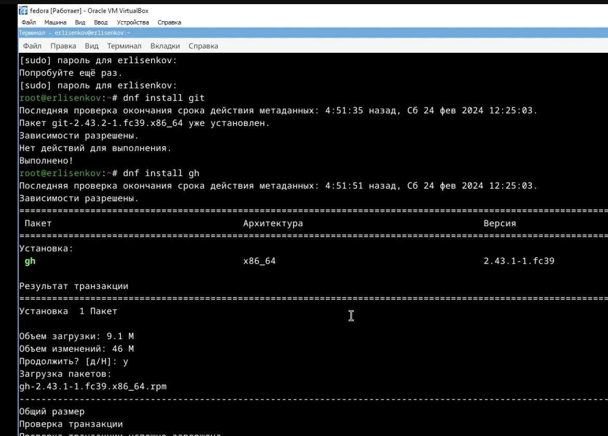{#fig:01 width=70%}

### Базовая настройка git

#### Создам имя и email владельца репозитория:

git config --global user.name "Name Surname"

git config --global user.email "work@mail"

#### Настрою utf-8 в выводе сообщений git:

git config --global core.quotepath false

#### Настрою верификацию и подписание коммитов git (см. Верификация коммитов git с помощью GPG).

#### Зададу имя начальной ветки (master):

git config --global init.defaultBranch master

#### Параметр autocrlf:

git config --global core.autocrlf input

#### Параметр safecrlf:

git config --global core.safecrlf warn

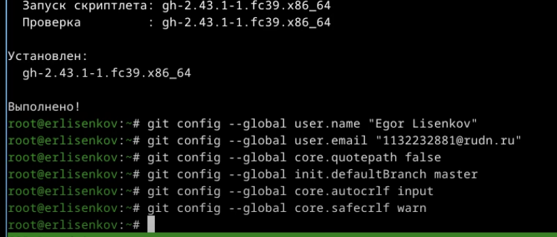{#fig:01 width=70%}

### Создам ключи ssh

#### по алгоритму rsa с ключём размером 4096 бит:

ssh-keygen -t rsa -b 4096

#### по алгоритму ed25519:

ssh-keygen -t ed25519

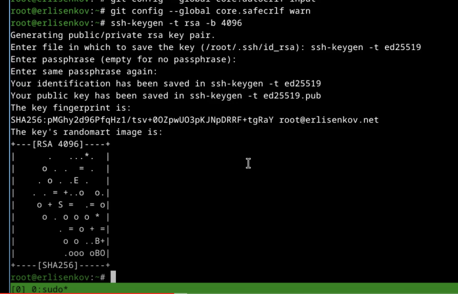{#fig:01 width=70%}

### Создам ключи pgp

#### Генерирую ключ

gpg --full-generate-key

#### Из предложенных опций выбираю:

тип RSA and RSA;

размер 4096;

выберу срок действия; значение по умолчанию — 0 (срок действия не истекает никогда).
GPG запросит личную информацию, которая сохранится в ключе:

Имя (не менее 5 символов).

Адрес электронной почты.

#### При вводе email пойму, что он соответствует адресу, используемому на GitHub.
#### Комментарий. Можно ввести что угодно или нажать клавишу ввода, чтобы оставить это поле пустым.

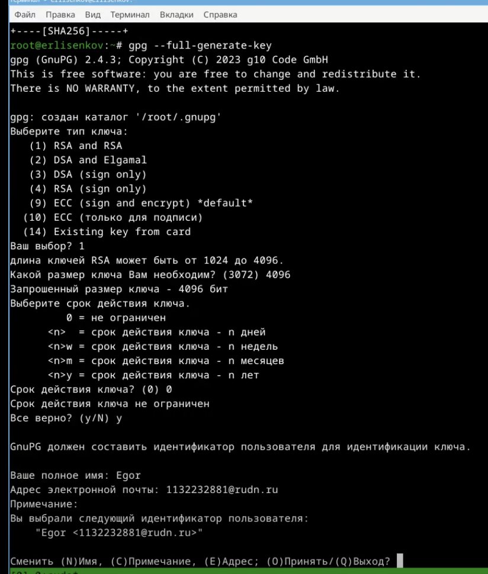{#fig:01 width=70%}

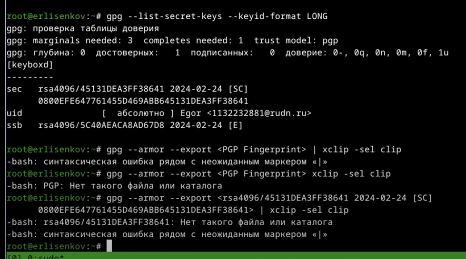{#fig:01 width=70%}

### Добавление PGP ключа в GitHub

#### Вывожу список ключей и копирую отпечаток приватного ключа:

gpg --list-secret-keys --keyid-format LONG

#### Отпечаток ключа — это последовательность байтов, используемая для идентификации более длинного, по сравнению с самим отпечатком ключа.

#### Формат строки:

sec   Алгоритм/Отпечаток_ключа Дата_создания [Флаги] [Годен_до]
      ID_ключа

#### Cкопируйте ваш сгенерированный PGP ключ в буфер обмена:

gpg --armor --export 45131DEA3FF28641 | xclip -sel clip

#### Перейдите в настройки GitHub (https://github.com/settings/keys), нажмите на кнопку New GPG key и вставьте полученный ключ в поле ввода.

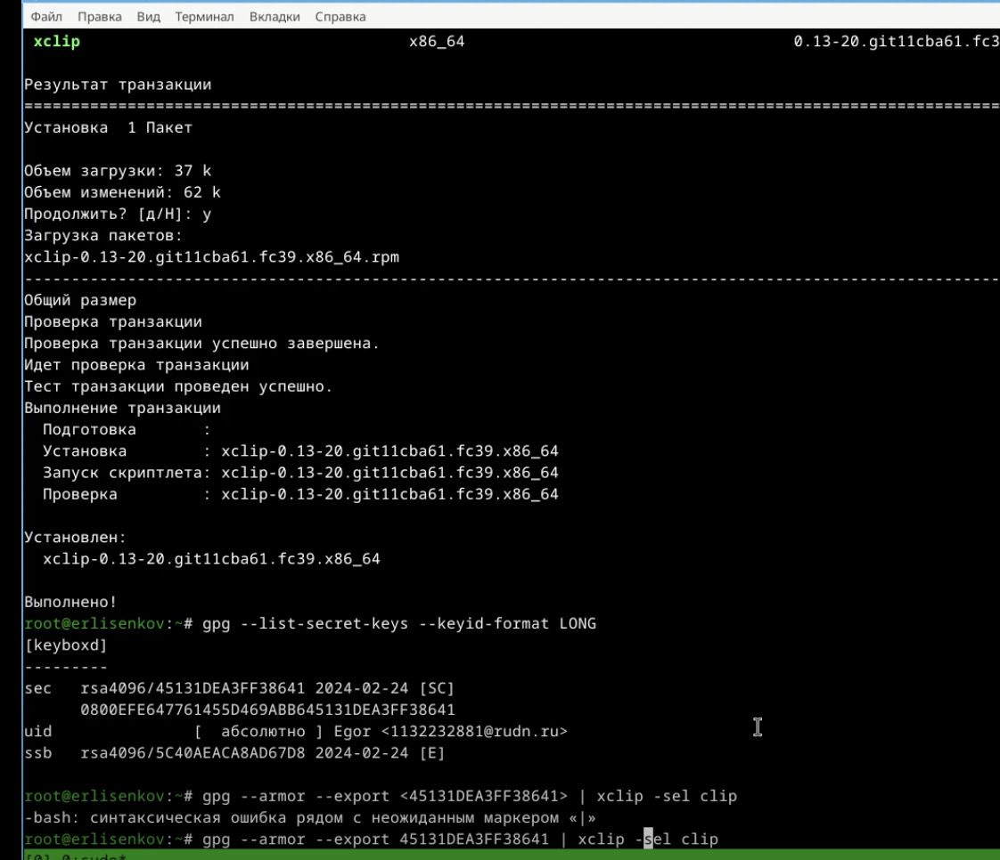{#fig:01 width=70%}

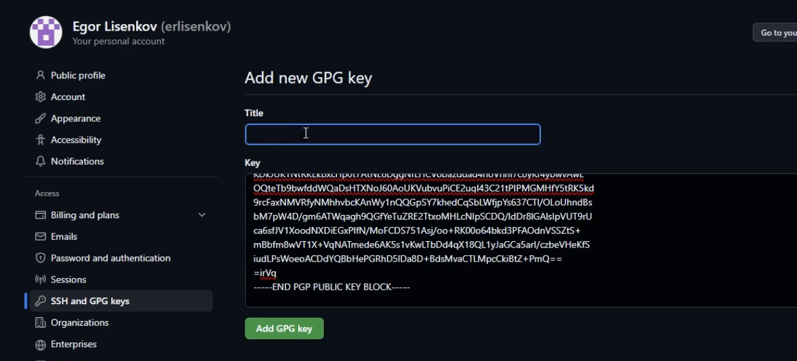{#fig:01 width=70%}

### Настройка автоматических подписей коммитов git

#### Используя введёный email, укажу Git применять его при подписи коммитов:

git config --global user.signingkey 45131DEA3FF28641

git config --global commit.gpgsign true

git config --global gpg.program $(which gpg2)

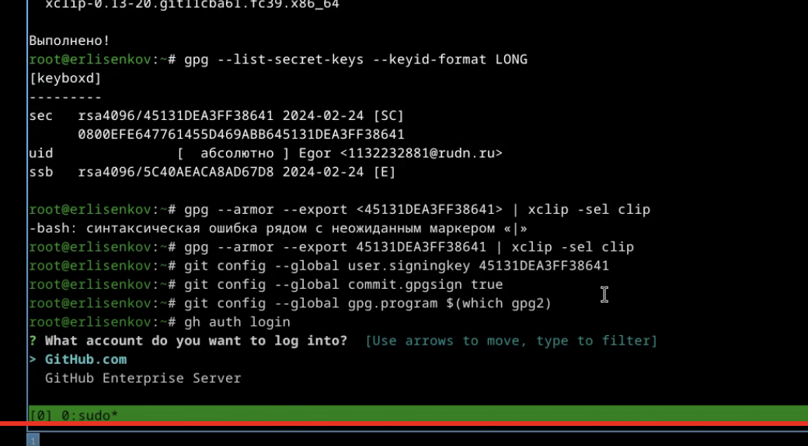{#fig:01 width=70%}

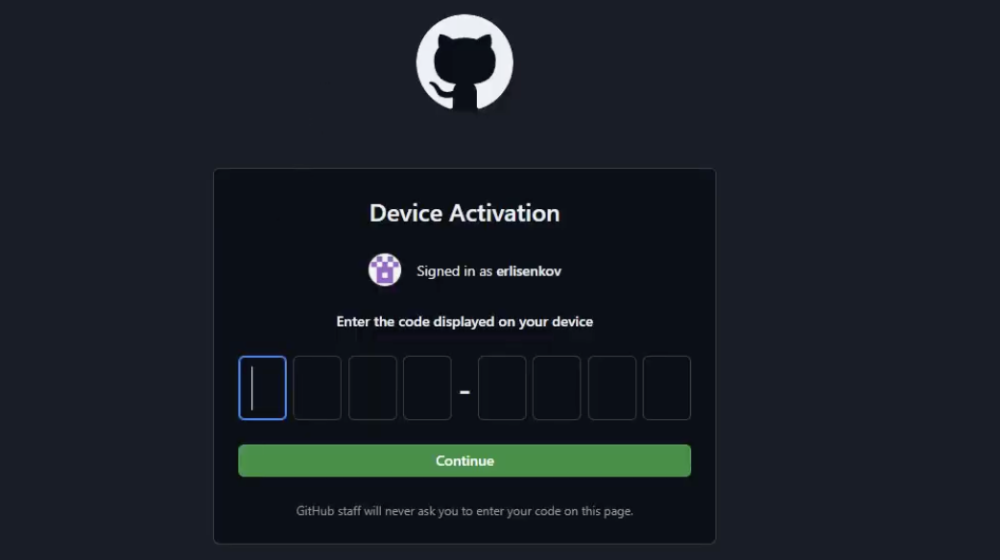{#fig:01 width=70%}

### Сознание репозитория курса на основе шаблона

#### Необходимо создать шаблон рабочего пространства (см. Рабочее пространство для лабораторной работы).

#### Например, для 2022–2023 учебного года и предмета «Операционные системы» (код предмета os-intro) создание репозитория примет следующий вид:

mkdir -p ~/work/study/2022-2023/"Операционные системы"

cd ~/work/study/2022-2023/"Операционные системы"

gh repo create study_2022-2023_os-intro --template=yamadharma/course-directory-student-template --public

git clone --recursive git@github.com:erlisenkov/study_2022-2023_os-intro.git os-intro

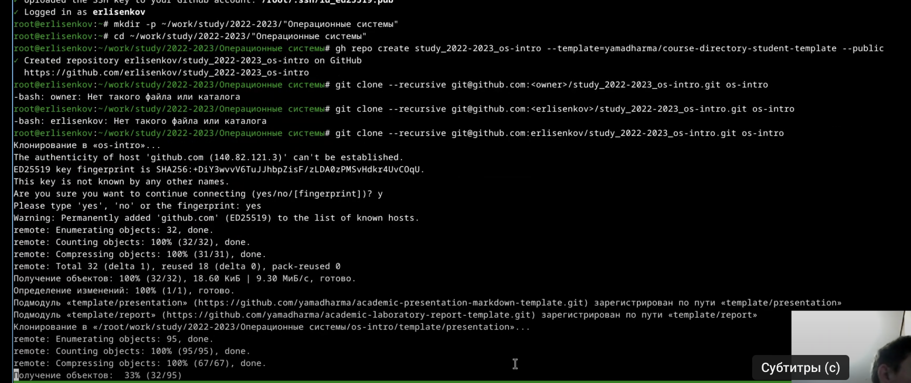{#fig:01 width=70%}

### Настройка каталога курса

#### Перейдём в каталог курса:

cd ~/work/study/2022-2023/"Операционные системы"/os-intro

#### Удалим лишние файлы:

rm package.json

#### Создадим необходимые каталоги:

echo os-intro > COURSE

make

#### Отправлю файлы на сервер:

git add .

git commit -am 'feat(main): make course structure'

git push

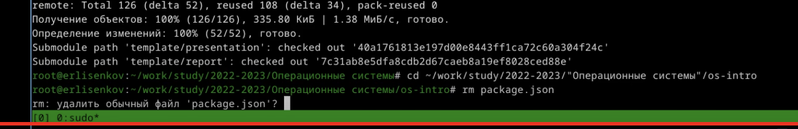{#fig:01 width=70%}

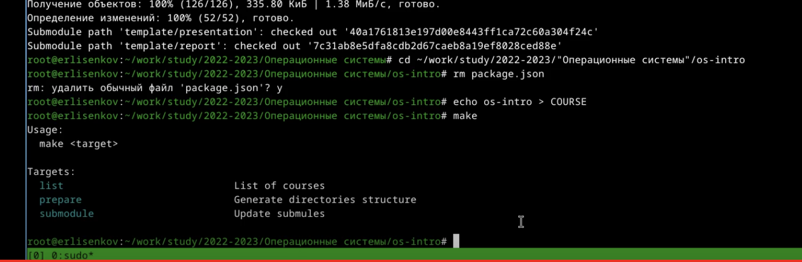{#fig:01 width=70%}

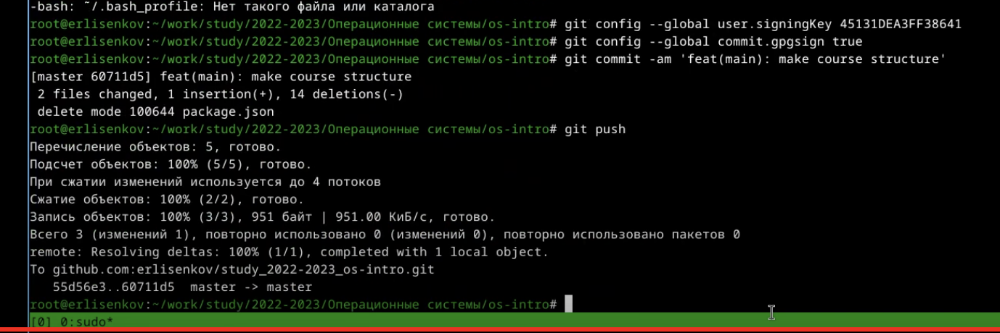{#fig:01 width=70%}

# Список литературы{.unnumbered}

::: {#refs}

1. Dash P. Getting started with oracle vm virtualbox. Packt Publishing Ltd, 2013. 86 p.

2. Colvin H. Virtualbox: An ultimate guide book on virtualization with virtualbox. CreateSpace Independent Publishing Platform, 2015. 70 p.

3. van Vugt S. Red hat rhcsa/rhce 7 cert guide : Red hat enterprise linux 7 (ex200 and ex300). Pearson IT Certification, 2016. 1008 p.

4. Робачевский А., Немнюгин С., Стесик О. Операционная система unix. 2-е изд. Санкт-Петербург: БХВ-Петербург, 2010. 656 p.

5. Немет Э. et al. Unix и Linux: руководство системного администратора. 4-е изд. Вильямс, 2014. 1312 p.

6. Колисниченко Д.Н. Самоучитель системного администратора Linux. СПб.: БХВ-Петербург, 2011. 544 p.

7. Robbins A. Bash pocket reference. O’Reilly Media, 2016. 156 p.
::: 
