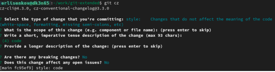

---
## Front matter
title: "Отчёт по лабораторной работе №4"
subtitle: "Операционные системы"
author: "Лисенков Егор Романович"

## Generic otions
lang: ru-RU
toc-title: "Содержание"

## Bibliography
bibliography: bib/cite.bib
csl: pandoc/csl/gost-r-7-0-5-2008-numeric.csl

## Pdf output format
toc: true # Table of contents
toc-depth: 2
lof: true # List of figures
lot: true # List of tables
fontsize: 12pt
linestretch: 1.5
papersize: a4
documentclass: scrreprt
## I18n polyglossia
polyglossia-lang:
  name: russian
  options:
	- spelling=modern
	- babelshorthands=true
polyglossia-otherlangs:
  name: english
## I18n babel
babel-lang: russian
babel-otherlangs: english
## Fonts
mainfont: PT Serif
romanfont: PT Serif
sansfont: PT Sans
monofont: PT Mono
mainfontoptions: Ligatures=TeX
romanfontoptions: Ligatures=TeX
sansfontoptions: Ligatures=TeX,Scale=MatchLowercase
monofontoptions: Scale=MatchLowercase,Scale=0.9
## Biblatex
biblatex: true
biblio-style: "gost-numeric"
biblatexoptions:
  - parentracker=true
  - backend=biber
  - hyperref=auto
  - language=auto
  - autolang=other*
  - citestyle=gost-numeric
## Pandoc-crossref LaTeX customization
figureTitle: "Рис."
tableTitle: "Таблица"
listingTitle: "Листинг"
lofTitle: "Список иллюстраций"
lotTitle: "Список таблиц"
lolTitle: "Листинги"
## Misc options
indent: true
header-includes:
  - \usepackage{indentfirst}
  - \usepackage{float} # keep figures where there are in the text
  - \floatplacement{figure}{H} # keep figures where there are in the text
---

# Цель работы

Научиться правильно работать с репозиториями git.

# Задание

1. Выполнить работу для тестового репозитория.
2. Преобразовать рабочий репозиторий в репозиторий с git-flow и conventional commits.

# Теоретическое введение

Gitflow Workflow опубликована и популяризована Винсентом Дриссеном.
Gitflow Workflow предполагает выстраивание строгой модели ветвления с учётом выпуска проекта.
Данная модель отлично подходит для организации рабочего процесса на основе релизов.
Работа по модели Gitflow включает создание отдельной ветки для исправлений ошибок в рабочей среде.
Последовательность действий при работе по модели Gitflow:
      Из ветки master создаётся ветка develop.
      Из ветки develop создаётся ветка release.
      Из ветки develop создаются ветки feature.
      Когда работа над веткой feature завершена, она сливается с веткой develop.
      Когда работа над веткой релиза release завершена, она сливается в ветки develop и master.
      Если в master обнаружена проблема, из master создаётся ветка hotfix.
      Когда работа над веткой исправления hotfix завершена, она сливается в ветки develop и master.

# Выполнение лабораторной работы

Выполню загрузку из коллекции репозиториев Corp. (рис. [-@fig:001])

{#fig:001 width=70%}

Выполню установку пакета Node.js, в которых находится программное обеспечение для выполнения 4 лабораторной работы. (рис. [-@fig:002])

{#fig:002 width=70%}

Далее выполню команду pnpm setup. (рис. [-@fig:003])

{#fig:003 width=70%}

Далее выполню команду, чтобы работать с окружением для git-flow. (рис. [-@fig:004])

{#fig:004 width=70%}

Выполню команду чтобы помочь в форматировании коммитов. (рис. [-@fig:005])

{#fig:005 width=70%}

Далее выполняем команду, которая будет создавать логи. (рис. [-@fig:006])

{#fig:006 width=70%}

Далее мы создаём репозиторий git-etended на Git&hub.
Тем самыс следующей командой создаём соответствующий репозиторий на консоли и заходим туда. (рис. [-@fig:007])

{#fig:007 width=70%}

Создадим первый файл README.md и выполним инициализацию репозитория . (рис. [-@fig:008])

{#fig:008 width=70%}

Выполню первый коммит и подключу удалённый репозиторий с помощью консольной команды git remote. Следующим шагом отправим изменения в репозиторий на сайт . (рис. [-@fig:009])

{#fig:009 width=70%}

Проверил что на сайте изменения были проведены. Далее создам файл package.json с помощью команды pnpm init.  (рис. [-@fig:010])

{#fig:010 width=70%}

Выполню небольшие изменения в файле. (рис. [-@fig:011])

{#fig:011 width=70%}

Добавлю новые файлы (git add) и выполню коммит (git cz). (рис. [-@fig:012]) 

{#fig:012 width=70%}

Отправлю изменения. (рис. [-@fig:013])

{#fig:013 width=70%}

Для дальнейшей работы я инициализирую git-flow с git flow init (Префикс: v). (рис. [-@fig:014]) 

{#fig:014 width=70%}

Выполню проверку, что нахожусь в ветке develop. (рис. [-@fig:015]) 

{#fig:015 width=70%}

Загружу весь репозиторий. (рис. [-@fig:016]) 

{#fig:016 width=70%}

Загрузим вешнюю вутку как вышестоящую. (рис. [-@fig:017]) 

{#fig:017 width=70%}

Создам релиз с версией 1.0.0. (рис. [-@fig:018]) 

{#fig:018 width=70%}

Создадим журнал изменений. (рис. [-@fig:019]) 

{#fig:019 width=70%}

Занесём в индекс журнал изменений. (рис. [-@fig:020]) 

{#fig:020 width=70%}

Далее выполняем команды, которые позволят нам положить релизную ветку в основную. Введём сообщения, чтобы программа понимала цели изменения. (рис. [-@fig:021])

{#fig:021 width=70%}

Успешное выполнение! (рис. [-@fig:022]) 

{#fig:022 width=70%}

Синхронизирую с git. (рис. [-@fig:023])

{#fig:023 width=70%}

Синхронизируем все поставленные теги. (рис. [-@fig:024])

{#fig:024 width=70%}

А теперь создадим релиз на git&hub. (рис. [-@fig:025]) 

{#fig:025 width=70%}

Дополнительно создам ветку для новой функциональности. (рис. [-@fig:026]) 

{#fig:026 width=70%}

Выполню объединение веток. (рис. [-@fig:027]) 

{#fig:027 width=70%}

Создам релиз 1.2.3. (рис. [-@fig:028]) 

{#fig:028 width=70%}

Подредактирую файл package.json поменяя версию на 1.2.3. (рис. [-@fig:029])

{#fig:029 width=70%}

Выполню создание журнала изменений. (рис. [-@fig:030])

{#fig:030 width=70%}

Добавим журнал изменений в индекс. (рис. [-@fig:031]) 

{#fig:031 width=70%}

Выполню перенаправление релизной ветки в основную ветку и отвечу на важные вопросы. (рис. [-@fig:032])

{#fig:032 width=70%}

Всё прошло успешно! (рис. [-@fig:033])

{#fig:033 width=70%}

Синхронизация с git.  (рис. [-@fig:034]) 

{#fig:034 width=70%}

Синхранизация тегов на git&hub. (рис. [-@fig:035]) 

{#fig:035 width=70%}

Создание релиза с комментарием из журнала изменений (на git.hub) . (рис. [-@fig:036]) 

{#fig:036 width=70%}

Все изменения были приняты и всё выполнилось!!!! (рис. [-@fig:037])

{#fig:037 width=70%}

# Выводы

Я получил самые важные знания для работы с git и более запомнил материал!

# Список литературы

[Лабораторная работа №4](https://esystem.rudn.ru/mod/page/view.php?id=1098794)
